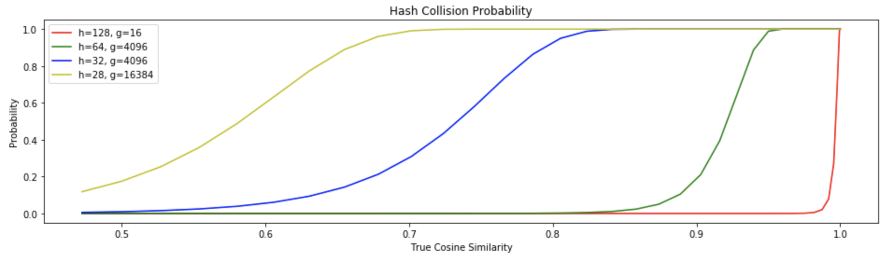
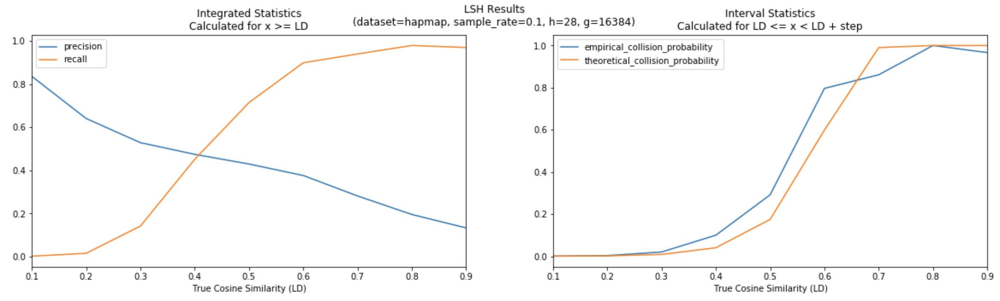

## LSH POC

The purpose of this experiment is to evaluate how well a simple LSH scheme can approximate LD for pairs of variants.  The notebooks in this small pipeline will:

1. Sample variants from some dataset
2. Compute ground-truth LD and store only pairs of variants passing a low minimum threshold
3. Compute LD implied by LSH hash collisions
4. Evaluate precision and recall of pairwise LD recognition by hash collision as a function of:
    - The number of random projections used in the hash
    - The LD threshold defining the ground truth links
    
The original outline for this process, though it is not an uncommon technique in many fields, was from [3].

### LSH Prototype 1

Notebook: [lsh-prototype-01.ipynb](misc/lsh-prototype-01.ipynb)

This was a quick and dirty attempt at the following two-pass solution for pair-wise LD calculations:

- Load an matrix containing genotype calls as n alt alleles (0, 1, or 2)
- Project this 2D matrix into a random space of lower dimension using M dimensions
- Apply SimHash [2] only to a **subset** of the $M$ dimensions 
    - Convert $k << M$ dimensions into bits (based on sign)
    - Create $g$ such groups of $k$ bit vectors (where $g * k$ still $< M$)
- Use the $g * k$ bits to form hash buckets 
    - Each variant (i.e. row) would then be assigned $g$ hash different buckets 
- Self-join these bucket assignments by hash group and hash value in order to determine whether or not any pair of variants collides in **any** of the groups
    - This "amplification" [4] for composite hashing is crucial for improving recall [1]
    - This explodes the hash assignments (which is a matrix of length equal to number of variants) into a table containing variant pairs with high levels of approximate similarity
- For each pair of variants in the same bucket, join to the full set of $M$ projections to estimate correlation (or distance or several other possibilities)
    - $M$ was kept as a separate paramter from those for the hash buckets so that the accuracy of the second-pass estimates could be tuned separately
    - This could use the original vectors instead, but the lower dimensional random projection preserves many statistical features so carrying full vectors around is likely not necessary
- Filter the variant pairs based on the estimated correlation

This prototype never made it to the final step because both the self-join and the join to projection vectors were slow and difficult to optimize (with only naive Dask implementations).

#### Prototype 1 Issues

- The self-join is very problematic
    - The number of pairs produced by hash group has a long tail
    - This means that memory consumption is far too high for certain groups
    - Some solutions for this issue are explained well in [scanns](https://github.com/linkedin/scanns#understanding-the-implementation), a Spark ANN library from Linkedin
- Xarray
    - Joins don't seem possible -- alignment is but not joins producing multiple results for the same join keys
        - This could be wrong, we'll see in https://github.com/pydata/xarray/issues/3791
- Dask
    - Block wise operations that produce cartesian products or other exploded representations far larger than the original block size are difficult to manage b/c there appears to be no way to stream results as there would be w/ spark
    - Dataframe joins are also tricky because every individual partition needs to fit in memory apparently, so you have to carefully track partition sizes
        - See https://docs.dask.org/en/latest/best-practices.html#avoid-very-large-partitions
    - You should use sorted joins on index where possible, though this requires thinking about whether or not the initial sort will be worth it
        - See https://docs.dask.org/en/latest/dataframe-design.html#dataframe-design-partitions
        - This amounts to setting an index, determining a better number of partitions (if necessary), and then joining dataframes on index rather than columns    

### LSH Prototype 2

Notebook: [lsh-prototype-02.ipynb](misc/lsh-prototype-02.ipynb)

Based on the first iteration, it seems unlikely that any naive approach via Dask/Xarray will work well for a two pass solution.  It doesn't really matter in the context of LD pruning though since as a result of [1], it is possible to make probabilistic statements about correlation between records in a dataset purely based on hash collisions (note that LD = pearson correlation = cosine similarity).  In other words, the number of signed hashes and the number of compositions of those hashes (the two parameters necessary) determine the probability that two records with a correlation above a certain value are detected via collision.  The dot product and therefore correlation is preserved under random projection [5, 6] and the relationship in [1] is summarized nicely in this [presentation](https://chanzuckerberg.github.io/ExpressionMatrix2/doc/LshSlides-Nov2017.pdf). This gives a formula that could be used to create an interface where an R2 threshold for LD pruning is given as well as some sense of "approximateness" around that threshold (it may have to be informed by pair-wise R2 distributions in real datasets), and then the actual random projection dimension and hash group counts become a function of those parameters. 

The expected relationship between composite hash parameters and collision probabilities is summarized below with a few examples:



Note that it is computationally efficient to detect highly correlated (LD >= .9) variants with high recall and precision, but doing so for less correlated variants (e.g. LD >= .2) requires a small number of hash bits and a very large number of hash amplifications.

This prototype was validated by computing true pair-wise LD for a sample of HapMap variants (w/ Hail) and comparing (w/ Spark) these results to pairs implied as correlated via hash collision (from Xarray/Dask).  A significant domain-specific complication here is that variants on separate contigs should have 0 LD, so presumably a more generic implementation to support this must allow for block sparsity -- but in this case, all tests were run for a single contig to simplify things.  Results from a single parameterization of the prototype show a strong correspondence between empirical and theoretical collision probabilities for variants with a known LD:




#### Prototype 2 Issues

- Xarray 
    - group by + reduce is inefficient over dask arrays.  For example, an operation like this is much cleaner through xarray but performs poorly:

```python
def hash_bits(x, axis=None):
    return xr.DataArray(da.apply_along_axis(
        lambda r: hash(np.asarray(r).tobytes()), 
        axis=axis, arr=x
    ))

H = (
    (P > 0)
    .groupby('hash_group')
    .reduce(hash_bits, dim='projection')
    .rename('hash_value')
)
H

# > Wall time: 2min 10s
```

by comparison to dropping down to the dask API:

```python
def hash_bits(x):
    return np.expand_dims(np.apply_along_axis(
        lambda r: hash(np.asarray(r).tobytes()), 
        axis=1, arr=x
    ), 1)

# The rechunking and boilerplate for conversion back to xarray is not ideal
xr.DataArray(
    (P > 0).data.rechunk(chunks=(P.data.chunksize[0], h))
    .map_blocks(hash_bits, chunks=(P.data.chunksize[0], 1))
    .compute(),
    dims=('variant', 'hash_group'),
    coords=dict(
        variant=P['variant'],
        hash_group=np.arange(g)
    ),
    name='hash_value'
)

# > Wall time: 10.3 s
```

- Dask
    - Dask doesn't implement ```np.packbits``` which is at least one way to help speed up hash computations
        - Using built-in ```hash``` for np arrays is probably very slow 
    - When a numpy function isn't supported by dask or you have to do calculations row/col-wise with a custom function, does using ```.compute()``` or ```np.asarray(dask_array)``` involve a lot of overhead for each vector?
    - How can calculations for groups of rows/cols be efficient if the number of those groups is large?
        - Rechunking to match the grouping works well for large groups, but not those with high cardinality
    - What is an efficient way to hash subsets of arrays (e.g. individual rows)?
    - Can you window a computation using non-uniform step sizes?
        - This may be necessary to ignore hash collisions between variants spanning contigs, in this use case
    - Can we do block sparsification for contigs as well as optional banded sparsification within blocks if a max locus window size is given?
        - Whether or not the second level of sparsification would make sense would depend on the size of the window

#### Notes

- Hashing numpy arrays
    - https://github.com/dask/dask/issues/3946#issuecomment-418568246
        - Ultimately, dask is just using md5 by default? ([base.py](https://github.com/dask/dask/blob/fde82b91d87c9a5b31fe2448105bd8c0500a6f9f/dask/base.py))
            - The docs state other faster hashing can be done: https://docs.dask.org/en/latest/array-api.html#dask.array.from_array
        - Called from [dataframe.io.from_array](https://github.com/dask/dask/blob/fde82b91d87c9a5b31fe2448105bd8c0500a6f9f/dask/dataframe/io/io.py#L99)
- Horner's method
    - See [implementation](https://github.com/linkedin/scanns/blob/master/scanns/src/main/scala/com/linkedin/nn/model/CosineSignRandomProjectionModel.scala#L37) in scanns
    - This is a nice way to do the bit hashing with a fixed maximum length (or at least it appears this doesn't work if there are more than 32 bits to hash in that example)
        
#### References

- [1] - [Hashing for Similarity Search: A Survey (Wang et al. 2014)](https://arxiv.org/pdf/1408.2927.pdf)
- [2] - [Similarity Estimation Techniques from Rounding Algorithms (Charikar 2002)](https://www.cs.princeton.edu/courses/archive/spr04/cos598B/bib/CharikarEstim.pdf)
    - This is the original simhash paper 
- [3] - [Shared Nearest Neighbor Clustering in a Locality Sensitive Hashing Framework](https://www.ncbi.nlm.nih.gov/pubmed/28953425)
    - This is a good example of random projection hashing applied to genomic sequence similarity pipelines
- [4] - [Mining of Massive Datasets, Ch. 3](http://infolab.stanford.edu/~ullman/mmds.html)
- [5] - [Improved Bounds on the Dot Product under Random Projection and Random Sign Projection (Kabán 2015)](https://www.cs.bham.ac.uk/~axk/fp621-kaban.pdf) 
- [6] - [Random Projection-based Multiplicative Data Perturbation for Privacy Preserving Distributed Data Mining (Liu et al. 2005)](https://www.csee.umbc.edu/~hillol/PUBS/mult_noise_privacyDM.pdf)
