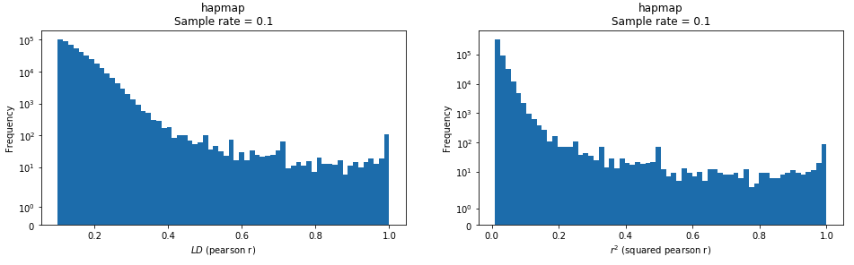

## Triangle Inequality POC

This prototype introduces a computational shortcut into the common LD pruning algorithm.  The base algorithm included here is almost identical to [scikit-allel/gn_locate_unlinked_int8](https://github.com/cggh/scikit-allel/blob/961254bd583572eed7f9bd01060e53a8648e620c/allel/opt/stats.pyx), but the implementation moves much of the out-of-core accomodations to dask ```map_overlap``` and ```rechunk```.  The pseudocode is:

1. Assume the array is not chunked in the column dimension (it must be tall and skinny) -- the standard LD prune algorithm will simply not work with blocking in both dimensions
2. Rechunk the arrays so that breaks occur at contigs as well as at maximum chunk sizes within contigs 
3. The standard LD prune algorithm works with a ```window``` and a ```step```, where ```step``` is generally ~10% of ```window```, so this algorithm enforces that chunk sizes are evenly divisible by ```step``` size so that the overlap between each block need only be ```window-step``` to ensure that all possible ```window``` + ```step``` combinations are calculated as in a single-core approach.
4. A list of row indices to keep is returned from each block calculation that needs to merged and de-duplicated before being applied to the original call matrix 

This implementation also makes the necessary changes to conform to ```numba.jit``` limitations.  Namely:

- Numpy reductions along an axis aren't supported (i.e. you can't do ```X.mean(axis=1)``` only ```X.mean()```)
- Dicts don't work -- there is a special numba dict type but Dask won't serialize it

The implementation itself is here: [pruning.py](https://github.com/related-sciences/gwas-analysis/blob/master/src/python/gwas_analysis/method/pruning.py).  The [pruning.ipynb](pruning.ipynb) notebook contains a version of this that is easier to experiment with.

The "Triangle Inequality" trick is added as an optional part of the algorithm that adapts the approach taken in [Fast approximate correlation for massive time-series data](https://www.semanticscholar.org/paper/Fast-approximate-correlation-for-massive-data-Mueen-Nath/d034d6057e3a553546fda16a304bc9c7e6e0fb81) (Mueen 2010).  The algorithm applied in this paper uses the fact that knowing correlation between any two vectors and a reference vector means you can place upper and lower bounds on the correlation between those two vectors without needing to calculate it.  The intuition for why this is helpful is to avoid comparing large numbers of variant pairs with low to no LD, given that the distribution of these correlation coefficients can look like this (with lots of density below common thresholds like .2 or .3):




This does end up being successful with higher r2 thresholds, but the extra computational cost for computing distance to reference vectors makes it a wash for lower thresholds:


The above compares this algorithm with PLINK.  Some other observations:

- This sample won't run without Numba on a timescale with the same order of magnitude 
    - I don't know how long it would have taken for certain, but it was going to be on the order of hours rather than seconds for sure
- Hail takes about 90 seconds to run with a .3 r2 threshold.  It doesn't support variant windows (only bp windows) so it was not compared to the others directly, but it seems like it would be a lot slower given that providing it bp windows actually equal to variant count windows (which should be advantageous for efficiency) still results in times 3x slower than the python approach.
- It is great to almost match PLINK times at high tresholds already. There may be some applications for this but lower thresholds are typically much more useful, at least upstream from common steps like PCA and kinship estimation.

